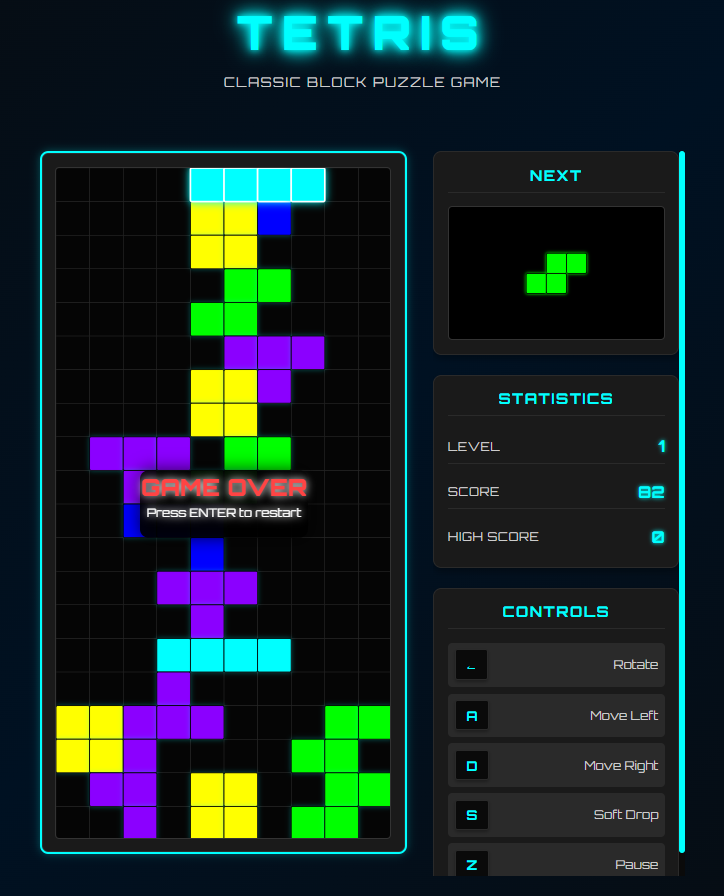

# 🎮 Enhanced Tetris Game

A modern, professional implementation of the classic Tetris game built with **TypeScript**, **RxJS**, and **Vite**. Features a beautiful dark theme with neon effects, classic Tetris colors, and responsive design.



## 🚀 Live Demo

🌐 **[Play the Game Online](https://kcmy-tetris-game-rxjs.netlify.app/)**

## ✨ Features

### 🎯 Gameplay Features
- **Classic Tetris Mechanics** - Authentic piece rotation, line clearing, and scoring
- **7 Standard Tetrominoes** - I, O, T, S, Z, J, L pieces with proper shapes
- **Classic Tetris Colors** - Each piece type has its authentic color (Cyan I-pieces, Yellow squares, etc.)
- **Next Piece Preview** - See what's coming next to plan your strategy
- **Scoring System** - Points for soft drops and line clears
- **Level Progression** - Increasing speed as you advance
- **High Score Tracking** - Persistent high score storage
- **Game Pause/Resume** - Pause anytime and resume when ready

### 🎨 Visual Enhancements
- **Modern Dark Theme** - Professional dark UI with neon cyan accents
- **Large Game Board** - 400×800px board for excellent visibility (40px blocks)
- **Responsive Design** - Works perfectly on desktop, tablet, and mobile
- **Zoom-Resistant Layout** - No overlapping issues when browser is zoomed
- **Smooth Animations** - Subtle glow effects and transitions
- **Professional Typography** - Orbitron font for that sci-fi game aesthetic

### 🎛️ Controls
- **A** - Move piece left
- **D** - Move piece right  
- **S** - Soft drop (move down faster)
- **←** - Rotate piece clockwise
- **Z** - Pause game
- **Y** - Resume game
- **Enter** - Restart game (when game over)

## 🛠️ Technologies Used

- **TypeScript** - Type-safe development with modern ES2020+ features
- **RxJS** - Reactive programming for game state management and user input
- **Vite** - Fast build tool and development server
- **SVG** - Crisp, scalable graphics for game rendering
- **CSS Custom Properties** - Modern styling with CSS variables
- **Google Fonts** - Orbitron font for enhanced typography
- **Vitest** - Testing framework for unit tests

## 🏗️ Architecture

This project follows **Functional Reactive Programming (FRP)** principles and is organized into clean, modular components:

### 📁 Project Structure
```
src/
├── main.ts          # Entry point and game loop orchestration
├── state.ts         # Game state management and transformations  
├── view.ts          # SVG rendering and visual updates
├── util.ts          # Utility functions and game logic helpers
├── types.ts         # TypeScript type definitions
├── constants.ts     # Game constants and configuration
└── style.css        # Modern styling and responsive design
```

### 🏛️ Key Architectural Patterns
- **Reactive Streams** - User input and game ticks as RxJS observables
- **Immutable State** - Pure functions and immutable state transformations
- **Separation of Concerns** - Clear separation between logic, state, and rendering
- **Type Safety** - Comprehensive TypeScript types for all game entities

## 🚀 Getting Started

### Prerequisites
- **Node.js** (v16 or higher)
- **npm** or **yarn**

### Installation

1. **Clone the repository**
```bash
git clone https://github.com/k-cmy/-Tetris-Game-using-RxJS- 
cd tetris-game-rxjs
```

2. **Install dependencies**
```bash
npm install
```

3. **Start development server**
```bash
npm run dev
```

4. **Open your browser** to `http://localhost:5174`

## 🎮 How to Play

1. **Start the Game** - Pieces automatically start falling from the top
2. **Control Pieces** - Use A/D to move, ← to rotate, S to drop faster
3. **Clear Lines** - Fill complete horizontal lines to clear them and score points
4. **Advance Levels** - Clear multiple lines to increase speed and difficulty
5. **Avoid Game Over** - Don't let pieces reach the top of the playing field

### 🏆 Scoring
- **Soft Drop**: 1 point per row dropped
- **Line Clear**: 100 points per line cleared
- **Multiple Lines**: Bonus points for clearing multiple lines at once

## 🧪 Development

### Running Tests
```bash
npm test          # Run tests in watch mode
npm run test:ui   # Run tests with UI
npm run test:run  # Run tests once
```

### Building for Production
```bash
npm run build     # Build optimized production bundle
```

The built files will be in the `dist/` directory, ready for deployment.

## 🌐 Deployment

This game can be easily deployed to various platforms:

### Quick Deploy Options
1. **Netlify** (Recommended)
   - Drag `dist/` folder to [netlify.com](https://netlify.com)
   - Instant live URL!

2. **Vercel**
   - Drag `dist/` folder to [vercel.com](https://vercel.com)
   - Connect GitHub repo for auto-deployments

3. **GitHub Pages**
   - Push to GitHub
   - Enable Pages in repository settings

### Automated Build Script
Use the included `deploy.bat` for easy building:
```bash
# Windows
deploy.bat

# Or manually
npm run build
```

## 🎯 Game Specifications

- **Grid Size**: 10×20 (standard Tetris dimensions)
- **Block Size**: 40×40px (large, crisp blocks)
- **Game Board**: 400×800px
- **Initial Speed**: 500ms per tick
- **Speed Increase**: Faster as levels progress
- **Piece Colors**: Authentic Tetris color scheme

## 🎨 Color Scheme

Each tetromino type has its classic color:
- **I-piece (Line)**: Cyan (`#00FFFF`)
- **O-piece (Square)**: Yellow (`#FFFF00`)
- **T-piece**: Purple (`#8B00FF`)
- **S-piece**: Green (`#00FF00`)
- **Z-piece**: Red (`#FF0000`)
- **J-piece**: Blue (`#0000FF`)
- **L-piece**: Orange (`#FFA500`)

## 🤝 Contributing

1. Fork the repository
2. Create a feature branch (`git checkout -b feature/amazing-feature`)
3. Commit your changes (`git commit -m 'Add amazing feature'`)
4. Push to the branch (`git push origin feature/amazing-feature`)
5. Open a Pull Request

## 📝 License

This project is open source and available under the [MIT License](LICENSE).

## 🙏 Acknowledgments

- **Classic Tetris** - Original game concept by Alexey Pajitnov
- **RxJS Community** - For the powerful reactive programming library
- **TypeScript Team** - For excellent tooling and type safety
- **Vite** - For lightning-fast development experience

---

**Enjoy playing! 🎮✨**

*If you like this project, please consider giving it a ⭐ on GitHub!*
